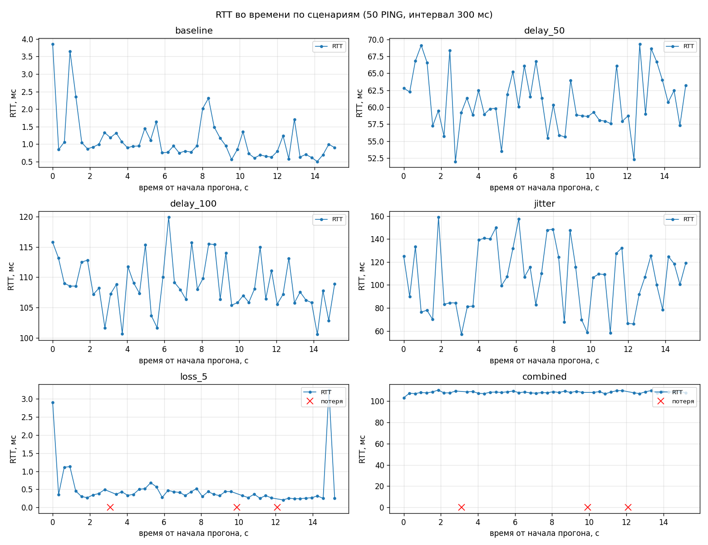
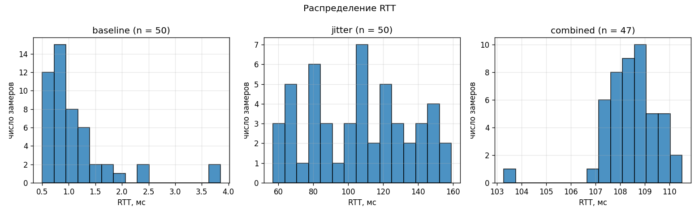
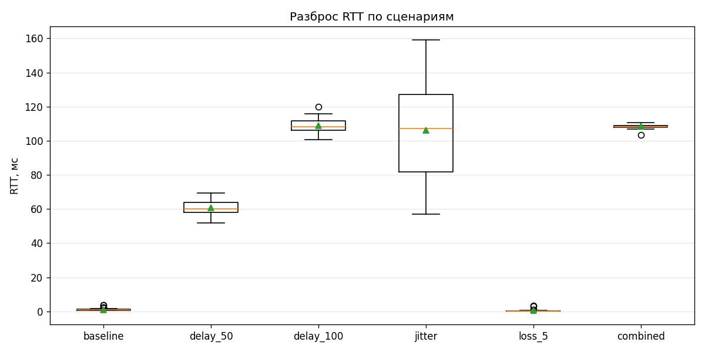

# Отчёт по измерению задержек UDP

Данные: `docs/latency_samples.csv` — 6 сценариев по 50 замеров, 300 строк.
Стенд и параметры прогона описаны в [Experiment_Config.md](Experiment_Config.md).
Графики построены скриптом `tools/plot_latency.py`.

## 1. Сводные метрики

| Сценарий    | Отправлено | Получено | Таймауты | min, мс | mean, мс | median, мс | max, мс | SRTT, мс | Джиттер, мс | Потери, % |
|-------------|-----------:|---------:|---------:|--------:|---------:|-----------:|--------:|---------:|------------:|----------:|
| `baseline`  | 50 | 50 | 0 | 0.503   | 1.131   | 0.942   | 3.852   | 0.849   | 0.446  | 0.00 |
| `delay_50`  | 50 | 50 | 0 | 51.992  | 60.875  | 59.937  | 69.287  | 61.558  | 4.728  | 0.00 |
| `delay_100` | 50 | 50 | 0 | 100.548 | 108.733 | 108.050 | 119.910 | 106.921 | 4.720  | 0.00 |
| `jitter`    | 50 | 50 | 0 | 56.941  | 106.122 | 107.125 | 159.017 | 105.473 | 28.295 | 0.00 |
| `loss_5`    | 50 | 47 | 3 | 0.207   | 0.511   | 0.360   | 3.246   | 0.615   | 0.290  | 6.00 |
| `combined`  | 50 | 47 | 3 | 103.281 | 108.423 | 108.355 | 110.513 | 108.680 | 1.016  | 6.00 |

Опоздавших (`late_response`), дублирующих (`duplicate_response`) и неизвестных
(`unknown_response`) ответов в этих шести прогонах не было: эмулятор в них не дублирует
датаграммы, а задержка нигде не превышала таймаут в 1000 мс. Обработка этих трёх случаев
проверена модульными тестами (`tests/LatencyTrackerTests.cs`).

## 2. RTT во времени

* `baseline` — около 1 мс с редкими выбросами до 4 мс: это не сеть, а планировщик ОС
  и сборка мусора, петля физической задержки не даёт.
* `delay_50` и `delay_100` — ровная «полка» на уровне заданной задержки: разброс держится
  в пределах ±10 мс и объясняется квантом системного таймера Windows (~15,6 мс),
  из-за которого `Task.Delay(50)` на практике даёт 50–65 мс.
* `jitter` — размах от 57 до 159 мс, ровно тот диапазон 50–150 мс, который задавался
  эмулятором (`delay=50,jitter=100`).
* `loss_5` и `combined` — красными крестиками отмечены замеры без ответа. Они пришлись
  на одни и те же номера (11, 33, 40): у обоих сценариев одно зерно генератора,
  и это прямое подтверждение воспроизводимости прогона.

## 3. Распределение RTT

* `baseline` — резкий пик около 0,5–1 мс и длинный правый хвост: типичная картина для
  задержки, ограниченной снизу и изредка растягиваемой планировщиком.
* `jitter` — распределение широкое и почти плоское: так и должна выглядеть равномерная
  случайная добавка 0–100 мс поверх постоянных 50 мс.
* `combined` — узкий пик около 108 мс: потери на форму распределения не влияют,
  они убирают замеры целиком, а не сдвигают их.

## 4. Разброс по сценариям

Box plot показывает то же самое компактно: у `baseline` и `loss_5` коробка прижата к нулю,
у сценариев с задержкой она поднята на величину эмуляции, а у `jitter` растянута
на весь диапазон — при близких медианах разброс отличается в разы. Для игры это важнее
среднего: именно разброс, а не сама задержка, ломает предсказание движения на клиенте.

## 5. Наблюдения

1. **Заданная задержка воспроизводится, но с систематической добавкой.** Медиана `delay_50`
   равна 59,9 мс, `delay_100` — 108,1 мс. Добавка в 8–10 мс одинакова в обоих сценариях,
   это квант системного таймера, а не ошибка измерения.

2. **SRTT сглаживает выбросы.** В `baseline` максимум RTT — 3,9 мс, а SRTT в конце прогона —
   0,85 мс: одиночный выброс входит в сглаженную оценку с весом 0,125 и за несколько
   следующих замеров «рассасывается». Поэтому SRTT ближе к медиане, чем к среднему,
   и на нём удобно строить адаптивный таймаут.

3. **Джиттер отличает сценарии, которые не отличает средний RTT.** У `delay_100`
   и `jitter` средние почти совпадают (108,7 против 106,1 мс), а средний джиттер отличается
   в шесть раз (4,7 против 28,3 мс). Для оценки качества канала одного среднего RTT мало.

4. **Доля потерь 6 % при заданных 5 %.** На 50 замерах один пакет — это 2 %, поэтому
   3 потери вместо ожидаемых 2,5 укладываются в статистический разброс; для точной оценки
   доли потерь нужна выборка в сотни пакетов.

5. **Потери не искажают RTT.** В `loss_5` и `combined` метрики RTT совпадают с `baseline`
   и `delay_100` соответственно: потерянные замеры учитываются отдельной строкой `timeout`
   и в расчёт RTT, SRTT и джиттера не попадают.

6. **Разница между `baseline` (1,13 мс) и `loss_5` (0,51 мс)** — не эффект потерь,
   а фоновая нагрузка машины: на масштабе долей миллисекунды прогоны отличаются друг
   от друга сильнее, чем от сценария.

## 6. Вывод

Подсистема телеметрии измеряет RTT по монотонным часам клиента, сглаживает его по формуле
`SRTT = 0.875 * SRTT + 0.125 * RTT`, считает джиттер как среднее отклонение соседних замеров
и долю потерь по числу таймаутов. Все пять состояний ответа (`received`, `timeout`,
`late_response`, `duplicate_response`, `unknown_response`) различаются и пишутся в журнал;
расчёт метрик вынесен в модуль `telemetry/`, сетевой ввод — в `transport/`,
разбор пакетов — в `protocol/`, поэтому телеметрию можно тестировать без сокетов,
что и делают 56 модульных тестов.
