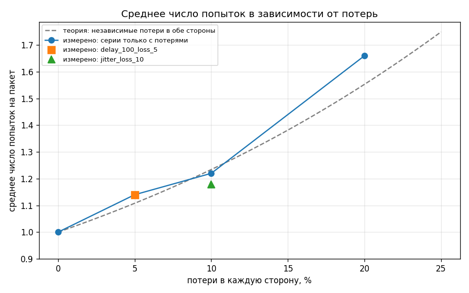
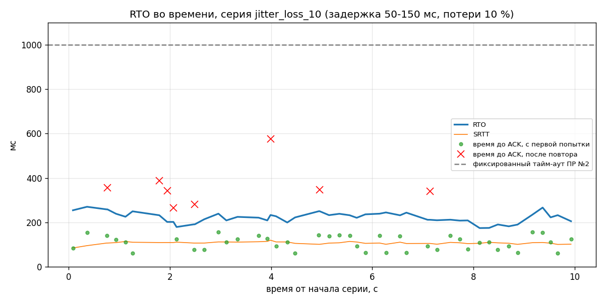

# Отчёт по надёжной доставке поверх UDP

## Состав команды

* Участник 1: расширение протокола, модуль `reliability`, клиент и сервер,
  эксперимент, отчёт.

## Архитектура

Работа продолжает ПР №1 (команды `MOVEMENT`/`SHOOT`) и ПР №2 (телеметрия `PING`/`PONG`).
Модули разделены так, чтобы логика надёжности не касалась сети:

| Модуль         | Что делает                                                                     |
|----------------|--------------------------------------------------------------------------------|
| `protocol/`    | заголовок версии 2 с полем `requiresAck`, пакеты `MOVEMENT`, `SHOOT`, `ACK`, проверки входных данных |
| `telemetry/`   | из ПР №2: монотонные часы и `LatencyTracker`, который даёт RTT по `PING`/`PONG` |
| `transport/`   | из ПР №2: UDP-сокет и эмулятор сети с зерном генератора                         |
| `reliability/` | `ReliableChannel` (учёт неподтверждённых пакетов), `AdaptiveTimeout` (RTO), `DeduplicationWindow` (окно на сервере), журнал доставки |
| `client/`      | игровой цикл: команды, повторы по RTO, разбор ACK                              |
| `server/`      | ACK на каждый надёжный пакет и однократное применение эффекта                  |

`ReliableChannel` и `AdaptiveTimeout` не знают ни про сокеты, ни про часы: время
приходит параметром. Поэтому оба класса проверяются тестами без сети.

### Какие команды сделаны надёжными и почему

* **`SHOOT` надёжный.** Выстрел это разовое событие: потерянный выстрел значит
  ненанесённый урон, и следующий пакет его не восполнит.
* **`MOVEMENT` ненадёжный.** Позиция уходит каждый такт, каждая следующая заменяет
  предыдущую целиком. Повтор старой позиции пришёл бы позже свежей и только откатил бы
  игрока назад, а ожидание ACK добавило бы задержку к самому частому типу трафика.
* **`PING`/`PONG` без подтверждений**, как и в ПР №2: потерянный замер просто не учитывается.

### Формат ACK и requiresAck

* В заголовок добавлен байт `requiresAck` (смещение 7), заголовок теперь 8 байт,
  версия протокола поднята до 2.
* `ACK` несёт один `uint16 acknowledgedSequence`, сам всегда идёт с `requiresAck = 0`.
  Пакет `ACK`, `PING` или `PONG` с `requiresAck = 1` отвергается при разборе: так протокол
  исключает подтверждение подтверждения.
* Повторная отправка повторяет пакет байт в байт, с тем же `sequenceNumber`.
* Сервер отвечает `ACK` сразу при получении, ещё до обработки, и отвечает на каждую копию.
  Эффект применяется только если номер не встречался в окне последних 256 номеров клиента.

Подробности формата: [Protocol_Specification.md](Protocol_Specification.md).

### Формула RTO и выбранные константы

```
первый замер:  SRTT = RTT,  RTTVAR = RTT / 2
далее:         RTTVAR = (1 - β) * RTTVAR + β * |SRTT - RTT|
               SRTT   = (1 - α) * SRTT   + α * RTT
RTO = clamp(SRTT + 4 * RTTVAR, 100 мс, 3000 мс)
```

| Параметр        | Значение | Почему                                                                 |
|-----------------|---------:|------------------------------------------------------------------------|
| α               | 0.125    | как в ПР №2 и в TCP: SRTT сглаживается медленно                         |
| β               | 0.25     | разброс реагирует на изменения быстрее среднего                         |
| множитель RTTVAR| 4        | запас на разброс: повтор не должен срабатывать на обычном колебании RTT |
| нижняя граница  | 100 мс   | на петле RTT около 1 мс, без границы RTO упал бы до единиц миллисекунд и ловил бы паузы планировщика ОС |
| верхняя граница | 3000 мс  | после этого команда уже бессмысленна для игры                           |
| RTO до замеров  | 1000 мс  | начальное значение по RFC 6298                                          |
| `maxAttempts`   | 5        | включая первую отправку                                                 |

Источники замеров RTT для `AdaptiveTimeout`:

* `PING`/`PONG` из ПР №2, один `PING` на каждую порцию команд;
* время до `ACK` надёжного пакета, **но только если пакет ушёл один раз** (правило Карна):
  после повтора неизвестно, на какую из копий пришёл ACK, и замер был бы ложным.

## Результаты

### Условия эксперимента

* Клиент и сервер на одной машине (Windows 11, .NET 9, Release), петля `127.0.0.1`.
* В каждой серии 50 команд `SHOOT` с интервалом 200 мс, вместе с каждой отправляются
  ненадёжный `MOVEMENT` и `PING`. Такт игрового цикла 10 мс, до 5 попыток на пакет.
* Сети эмулирует `EmulatedTransport` из ПР №2. Потери заданы **в обе стороны**: клиент
  теряет часть своих команд, сервер теряет часть ответов. Задержка и джиттер добавляются
  только на стороне сервера, поэтому входят в RTT один раз, как в ПР №2.
* Зерно генератора: сервер 20251002, клиент 20251003.
* До начала серии клиент делает 2 прогревочных обмена вне журнала: без них первый ACK
  шёл 240 мс из-за JIT-компиляции и задирал начальный RTO.

Повторить прогон: `tools/run_experiments.ps1`, затем `tools/plot_reliability.py`.

| Серия | Отправлено | Доставлено с 1-й попытки | Retransmit total | Failed | Avg attempts | Avg RTO, мс | Time-to-ACK, мс |
|---|---:|---:|---:|---:|---:|---:|---:|
| baseline | 50 | 50 (100 %) | 0 | 0 | 1.00 | 100.0 | 0.8 |
| loss_5 | 50 | 43 (86 %) | 7 | 0 | 1.14 | 100.0 | 16.0 |
| loss_10 | 50 | 41 (82 %) | 11 | 0 | 1.22 | 100.0 | 24.7 |
| loss_20 | 50 | 31 (62 %) | 33 | 0 | 1.66 | 100.0 | 72.9 |
| delay_100_loss_5 | 50 | 43 (86 %) | 7 | 0 | 1.14 | 123.9 | 127.1 |
| jitter_loss_10 | 50 | 42 (84 %) | 9 | 0 | 1.18 | 222.2 | 149.6 |

`Avg RTO` это среднее значение RTO в моменты, когда решалась судьба каждого пакета,
`Time-to-ACK` считается от первой отправки до ACK по доставленным пакетам.

Дополнительные показатели тех же серий:

| Серия | RTO в конце, мс | Повторов отсечено сервером | Попыток по теории | Распределение попыток (1/2/3/4/5) |
|---|---:|---:|---:|---|
| baseline | 100.0 | 0 | 1.00 | 50 / 0 / 0 / 0 / 0 |
| loss_5 | 100.0 | 4 | 1.11 | 43 / 7 / 0 / 0 / 0 |
| loss_10 | 100.0 | 8 | 1.23 | 41 / 7 / 2 / 0 / 0 |
| loss_20 | 100.0 | 15 | 1.55 | 31 / 10 / 5 / 3 / 1 |
| delay_100_loss_5 | 112.8 | 4 | 1.11 | 43 / 7 / 0 / 0 / 0 |
| jitter_loss_10 | 205.2 | 5 | 1.23 | 42 / 7 / 1 / 0 / 0 |

Теория: при независимых потерях `p` в каждую сторону обмен удачен с вероятностью
`q = (1 - p)²`, ожидаемое число попыток `Σ (1 - q)^k` по `k` от 0 до 4.

Повторных ACK (ответов на уже подтверждённый пакет) клиент не получил ни в одной серии:
ложных повторов, когда RTO истёк раньше настоящего ответа, не было.

## Графики



Измеренные точки идут вдоль теоретической кривой. Серии `delay_100_loss_5`
и `jitter_loss_10` ложатся рядом с сериями с теми же потерями: число попыток
определяется потерями, а не задержкой, задержка влияет только на время до ACK.



RTO держится в коридоре 174-270 мс, выше всех ответов с первой попытки (самый долгий
пришёл за 157 мс), и примерно в 2 раза выше SRTT: запас даёт член `4 * RTTVAR`, который
при джиттере 50-150 мс велик. Красные крестики это пакеты, доставленные после повтора:
их время до ACK равно ожиданию RTO плюс ещё один обмен.

## Анализ

### Как адаптивный RTO ведёт себя при росте задержки по сравнению с фиксированным тайм-аутом ПР №2?

Фиксированный тайм-аут ПР №2 (1000 мс) годился для решения «замер потерян», но для
повторов он слишком велик: каждый повтор стоил бы секунду ожидания. Оценка по журналу,
если подставить 1000 мс вместо фактического RTO перед каждым повтором:

| Серия | Time-to-ACK с адаптивным RTO, мс | С фиксированными 1000 мс, мс (оценка) |
|---|---:|---:|
| loss_5 | 16.0 | около 142 |
| loss_10 | 24.7 | около 223 |
| loss_20 | 72.9 | около 667 |
| delay_100_loss_5 | 127.1 | около 251 |
| jitter_loss_10 | 149.6 | около 289 |

Адаптивный RTO следует за сетью: на петле он прижат к нижней границе 100 мс,
при задержке 100 мс поднимается до 110-290 мс, при джиттере держится около 220 мс.
В обратную сторону фиксированное значение тоже опасно: при RTT больше 1000 мс оно
дало бы повтор на каждый пакет, а адаптивный RTO вырос бы вслед за RTT.

Слабое место видно в `delay_100_loss_5`: задержка стабильная, RTTVAR быстро падает,
и RTO к концу серии всего 112,8 мс при RTT около 108 мс. Запас в несколько миллисекунд
сравним с квантом таймера Windows (около 15,6 мс), так что ложный повтор здесь возможен.
В этом прогоне его не было, но это аргумент держать нижнюю границу RTO не меньше 100 мс.

### Что произошло с пакетами в серии loss_20: сколько ушло в failed и почему?

В `failed` не ушёл ни один пакет. При потерях 20 % в каждую сторону обмен удачен
с вероятностью `q = 0,8² = 0,64`, все 5 попыток проваливаются с вероятностью
`0,36⁵ ≈ 0,6 %`, то есть ожидается 0,3 пакета на серию из 50. Ближе всего к недоставке
был один пакет: он дошёл только с пятой, последней попытки. Ещё 3 пакета потребовали
четыре попытки.

Среднее число попыток 1,66 выше теоретических 1,55: на 50 пакетах один пакет с пятью
попытками сдвигает среднее на 0,08, это статистический разброс. Для проверки
окончательной недоставки служат тесты `ReliableChannelTests`, а при `maxAttempts = 2`
в той же серии в `failed` ушло бы около 13 % пакетов (`0,36²`).

Окончательная недоставка обрабатывается так: `ReliableChannel` переносит пакет
в список недоставленных и вызывает событие `PacketFailed`, клиент пишет в лог
«выстрел не подтверждён сервером» и строку `failed` в журнал. Для игры это значит,
что выстрел не состоялся: клиент должен откатить предсказанный эффект (вспышку,
расход патрона) и показать игроку, что попадания не было.

### Как окно дедупликации на сервере предотвращает повторное применение эффекта команды?

Повтор приходит с тем же `sequenceNumber`, что и оригинал. Сервер хранит для каждого
клиента окно последних 256 обработанных номеров: если номер уже есть в окне, сервер
подтверждает пакет ещё раз, но эффект не применяет. В `loss_20` сервер отсёк 15 повторов:
это случаи, когда команда дошла, а потерялся ACK. Остальные 18 из 33 повторов либо
потерялись сами, либо доставили команду, оригинал которой не дошёл, и тогда эффект
применён впервые. Без окна каждый из 15 случаев стал бы лишним выстрелом.

Окно ограничено по размеру, чтобы не расти бесконечно, и при этом много меньше
пространства номеров `uint16`: иначе после оборота счётчика новая команда совпала бы
с устаревшей записью.

## Вывод

Поверх UDP построен канал надёжной доставки для критичной команды `SHOOT`: подтверждения
`ACK`, повторы по адаптивному RTO (Джекобсон, правило Карна), ограничение в 5 попыток
с явной обработкой недоставки и окно дедупликации на сервере. При потерях до 20 %
в каждую сторону все 300 команд шести серий доставлены, ни одна не применилась
дважды, а время до подтверждения меньше, чем дал бы фиксированный тайм-аут из ПР №2:
примерно в 9 раз в сериях с одними потерями и в 2 раза в сериях с задержкой и джиттером. Логика надёжности отделена от сетевого ввода-вывода и покрыта 55 модульными тестами.
